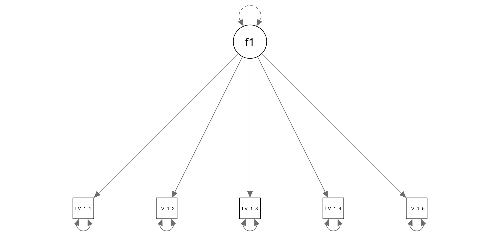

## Overview 


::: {.cell}

:::


* Introduction to factor analysis
* Overview of EFA
* Overview of CFA 

## What is Factor Analysis

<strong>Factor analysis</strong> is a data reduction technique that seeks to explain the covariation among a set of observed variables by positing a (usually) smaller subset of unobserved or latent variables. Any covariation that is not explained by the set of latent variables is contained in an error or uniqueness term for each observed variable.

## A Brief History

* Charles Spearman (1904) develops factor analysis to test is theory of general intelligence
* Louis Thurstone (1930s) expands on Spearman's work and shows how to extract multiple factors
* Joreskog (1960s) introduces a way to obtain maximum likelihood solutions for CFA and LISREL is born
* From the 1960s and onwards there has been a lot of reserach on CFA and more general latent variable frameworks 

## The Common Factor Model


::: {.cell}
::: {.cell-output-display}
{width=960}
:::
:::


## The Statistical Logic Underlying Factor Analysis

* All factor analytic methods (EFA + CFA) try to do one specific thing: <strong>reproduce the observed covariance or correlation structure in one's observed data</strong>. 

* Each factor model you build implies a specific covariance structure, $\mathbf{\Sigma(\Theta)}$, and its your goal to specify a model that implies a covariance structure that closely matches the covrariance structure of your observed data, $\mathbf{S}$.

$$min(\mathbf{\Sigma(\Theta)}-\mathbf{S})$$

## Implied Equations for Common Factor Model

$$X_{1}=\lambda_{1}\xi_{1}+\delta_{1}$$

$$X_{2}=\lambda_{2}\xi_{1}+\delta_{2}$$

$$X_{p}=\lambda_{p}\xi_{1}+\delta_{p}$$

## Model Implied Covariance

$$\begin{align}
Cov(X_{p}, X_{p'})&=E[X_{p}X_{p'}]-E[X_{p}]E[X_{p'}]\\
&=E[(\lambda_{p}\xi_{1}+\delta_{p})(\lambda_{p'}\xi_{1}+\delta_{p'})] -E[\lambda_{p}\xi_{1}+\delta_{p}]E[\lambda_{p'}\xi_{1}+\delta_{p'}]\\
&=E[\lambda_{p}\lambda_{p'}\xi_{1}^{2}]-E[\lambda_{p}\xi_{1}]E[\lambda_{p'}\xi_{1}]\\
&=\lambda_{p}\lambda_{p'}(E[\xi_{1}^{2}] - E[\xi_{1}]^{2})\\
&=\lambda_{p}\lambda_{p'}\phi_{1}\\
\end{align}$$

## Implied Equations with Matrix Algebra

$$\begin{bmatrix}
X_{1}\\
X_{2}\\
X_{p}\\
\end{bmatrix}_{p\times1}=
\begin{bmatrix}
\lambda_{1}\\
\lambda_{2}\\
\lambda_{p}
\end{bmatrix}_{p \times q}
\begin{bmatrix}
\xi_{1}\\
\end{bmatrix}_{q \times 1} +
\begin{bmatrix}
\delta_{1}\\
\delta_{2}\\
\delta_{p}\\
\end{bmatrix}_{p \times 1}
$$

$$\mathbf{x}=\mathbf{\Lambda_{x}}\mathbf{\xi}+\mathbf{\delta} $$

## Model Implied Covariance with Matrix Algebra

$$
\begin{align}
E[\mathbf{x}\mathbf{x}']&=E[(\mathbf{\Lambda_{x}}\mathbf{\xi}+\mathbf{\delta})(\mathbf{\Lambda_{x}}\mathbf{\xi}+\mathbf{\delta})^{'}]\\
&=E[\mathbf{\Lambda_{x}}\mathbf{\xi}\mathbf{\xi'}\mathbf{\Lambda_{x}}] + 2E[\mathbf{\Lambda_{x}\xi}\delta']+E[\mathbf{\delta\delta'}]\\
&=\mathbf{\Lambda_{x}}E[\mathbf{\xi\xi'}]\mathbf{\Lambda_{x}} + 2 \mathbf{\Lambda_{x}}E[\mathbf{\xi\delta'}]+E[\mathbf{\delta\delta'}]\\
&=\mathbf{\Lambda_{x}\Phi\Lambda_{x}'}+\mathbf{\Theta_{\delta}}\\
&=\mathbf{\Sigma(\Theta)}\\
\end{align}
$$ 

## Why do we love factor analysis? 

* Specifies latent variables
* Corrects your measurements for (some) measurement error

## Latent variables: What are they?

* Social constructs that exist in the minds of researchers?
* Real entities that exist independent of our measurements?
* A convenient way to summarize emergent phenomena? 
* A variable where there is no "sample realization" for some part of the sample?

## Measurement Error: Where does it go?

* Factor analylsis partitions measurement error from observed varinace in the theta-delta matrix: $\mathbf{\Theta_{\delta}}$

$$\mathbf{S}=\underbrace{\mathbf{\Lambda_{x}\Phi\Lambda_{x}'}}_{\text{Communality}}+ \underbrace{\mathbf{\Theta_{\delta}}}_{\text{Systematic & Random Error}}$$


## Factor Analysis: Exploratory vs Confirmatory 

* Factor analysis is traditionally separated into two distinct methods: 
  - Exploratory Factor Analysis 
  - Confirmatory Factor Analysis

# Exploratory Factor Analysis

## What is EFA? 

* EFA is a data driven approach to discover the underlying factor structure of one's data based on the covariance structure of one's observed data. 

* Similar to CFA, EFA tries to maximize (or minimize) a fit function that compares the model implied covariance matrix to the observed covariance matrix, but <strong>EFA does not place any constraints on which items measure which factors!</strong>

## Researcher Degrees of Freedom in EFA

1. How to estimate model (Factor Extraction Method)
2. How to determine the number of factors (Factor Retention Method)
3. Determine if factors should correlate with one another (Factor Rotation Method) 

## Factor Extraction in EFA

* Factor extraction in EFA refers to the model estimation method: 
  - Maximum Likelihood (ML) Estimation (My preferred)
  - Principal Axis Factoring (PAF)
  - Variety of least square methods 
  - SO MUCH MORE! 

* Like all things, there is no one size fits all solution, but just <strong>do not use Principal Components Analysis!</strong>

## Factor Retention in EFA

* Given the exploratory nature of EFA, the researcher may not know the exact number of factors underlying their data, so they must rely on several heuristic and statistical methods to determine the number: 
  - Eigenvalues > 1.0 rule (Kaiser Criterion)
  - Scree Plot 
  - Parallel Analysis
  - Very Simple Structure (VSS)
  - Fit Indices 

* Again, there is no one size fits all solution, you should exercise sound judgment, use all of the above methods, and carefully report what you have done. 

## Factor Rotation in EFA

* The TLDR here is that you can specify that the factors in your model should either correlate (oblique rotation) or not correlate (orthogonal rotation). The rotation method you choose should improve the interpretability of your factor model.

* The rule of thumb here is use an oblique rotation like promax or oblimin because all social and behavioral data tends to be correlated.

## EFA Example: R Code


::: {.cell}

```{.r .cell-code}
# Estimate the sample correlation matrix 
efa_cor_matrix <- cor(efa_data)

# Plot the scree plot with the Kaiser Criterion
psych::scree(efa_data, factors = FALSE)

# Determine the % of total variation the components account for
eigen(efa_cor_matrix)$values / sum(eigen(efa_cor_matrix)$values)

# Conduct Parallel Analysis
psych::fa.parallel(
  x = efa_data,
  fa = "pc",
  fm = "ml"
)

# Conduct VSS Analysis
psych::vss(
  x = efa_data,
  n = 8,
  rotate = "promax",
  fm = "ml"
)

# Estimate the EFA model with 3 factors
efa_solution <- 
  psych::fa(
    r = efa_data,
    nfactors = 3,
    fm = "ml"
)
```
:::


## Parallel Analysis


